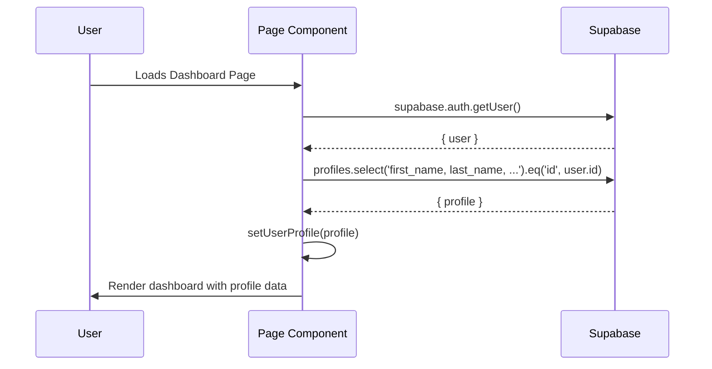
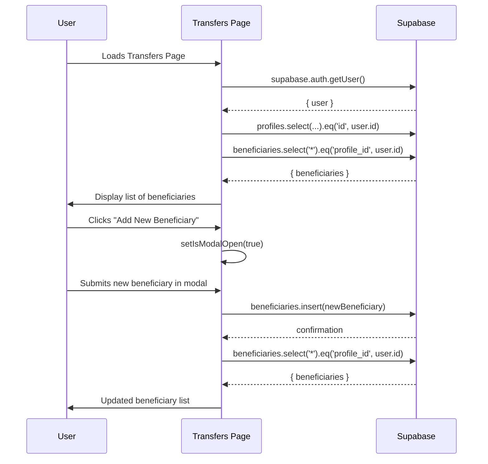
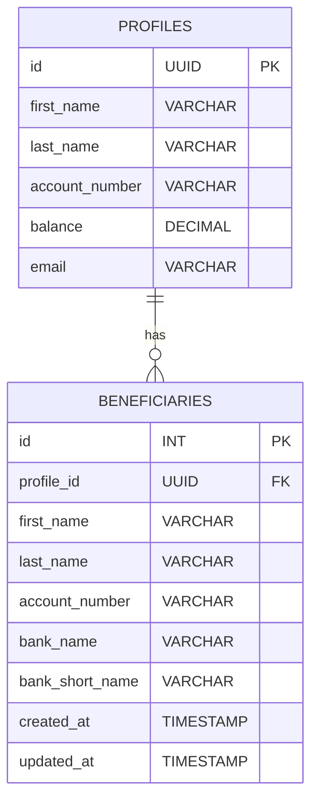
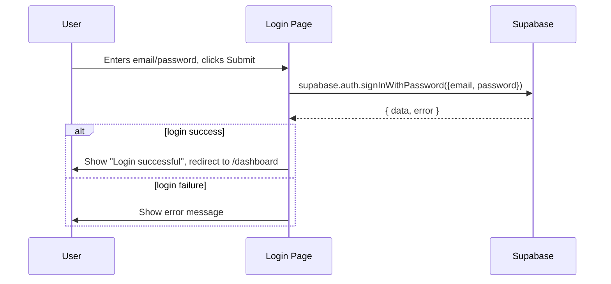

# MANEE WEB APP

## Swift as a bullet, Reliable as an instinct

### METADATA

- [Design File](https://www.figma.com/design/2f2pddizmkbHyzyzyYct4U/wizard.fig?node-id=542-522&t=2BE1c62gBw525me6-1)
- Stacks: ["NextJs", "Tailwind CSS", "Typescript", "React Icons"]

# 📄 Application Source Code Documentation

This documentation provides a comprehensive overview of three key files in a Next.js/React banking dashboard application: three `page.tsx` files. The files correspond to **Dashboard (user home)**, **Transfers (beneficiaries and transfers)**, and **Login page**. The code integrates with **Supabase** for authentication and database operations, leverages UI component abstractions, and uses theming support.

---

## **Index**

1. [Overview](#overview)
2. [Dashboard Page (`page.tsx` #1)](#dashboard-page)
   - Features
   - Data Flow
   - UI Structure
   - Sequence Diagram: Profile Fetching
3. [Transfers/Beneficiaries Page (`page.tsx` #2)](#transfersbeneficiaries-page)
   - Features
   - State Logic & Modals
   - Data Flow
   - Sequence Diagram: Beneficiary Management
   - Entity Relationship Diagram: User & Beneficiary
4. [Login Page (`page.tsx` #3)](#login-page)
   - Features
   - Form Logic
   - Data Flow
   - Sequence Diagram: Login Process
5. [Common Patterns & Security Considerations](#common-patterns--security-considerations)
6. [Component Overview](#component-overview)

---

## Overview

This application implements a user-facing **digital banking dashboard** built with React, Next.js, TailwindCSS, and Supabase for authentication and storage. It features:

- Themed UI with dark/light switching via `next-themes`
- Modular, reusable UI components (cards, navigation, forms)
- Authentication and access control via HOC
- Real-time data fetch from Supabase (user profile, beneficiaries)
- Transaction initiation and management functionality
- Responsive layout for desktop and mobile

---

## Dashboard Page

### **File:** `page.tsx` (Dashboard/User Home)

### **Purpose**

This file renders the **main dashboard** for authenticated users, displaying:

- User account summary (name, balance, account number)
- Quick transaction shortcuts (transfers, airtime, loans)
- Profile management shortcuts
- Recent transaction history

### **Features**

| Feature             | Description                                                |
| ------------------- | ---------------------------------------------------------- |
| Profile Fetch       | Pulls user profile data from Supabase and displays it      |
| Quick Actions       | UI cards for transfer, airtime, loan, games                |
| Profile Management  | Shortcut cards to edit, request cards, upgrade, reset auth |
| Transaction History | Sidebar with transaction/transfer history                  |
| Theming             | Dark/light mode via `ThemeProvider` and CSS variables      |
| Protected Route     | Wrapped with `WithAuthentication` to enforce login         |

### **Data Flow**

1. **On Mount**: Fetches current user from Supabase Auth.
2. **If authenticated**: Queries the user's profile from the `profiles` table.
3. **Displays**: Account summary and action cards.
4. **History**: Loads via the `<History />` component (not detailed here).

### **UI Structure**

```
ThemeProvider
└── Flex Container
    ├── SideNav
    └── Main Content
        ├── HeaderNav (shows user's name/email)
        ├── Account Cards (summary x2)
        ├── Quick Transactions (IconCard shortcuts)
        ├── Profile Management (IconCard shortcuts)
        └── History (right panel)
```

### **Sequence Diagram: Profile Fetching and Rendering**



---

## Transfers/Beneficiaries Page

### **File:** `page.tsx` (Transfers/Beneficiaries)

### **Purpose**

This page allows users to:

- View and manage their list of **beneficiaries**
- Initiate **interbank/intrabank transfers** to beneficiaries
- Add/remove beneficiaries via modals
- View account summary and transaction history

### **Features**

| Feature                  | Description                                                 |
| ------------------------ | ----------------------------------------------------------- |
| Beneficiary List         | Fetch and display user's beneficiaries from Supabase        |
| Add/Manage Beneficiaries | Modal dialogs for adding or managing existing beneficiaries |
| Transfer Forms           | Shows interbank/intrabank form (default: interbank)         |
| Beneficiary Selection    | Clicking a beneficiary fills transfer form details          |
| Theming                  | Dark/light mode via ThemeProvider                           |
| Protected Route          | Wrapped with `WithAuthentication`                           |
| History                  | Shows transaction history in a sidebar                      |
| Dropdown Logic           | Kebab menu for modals (add/manage) with click-outside close |

### **State Logic & Modals**

- State for user profile, beneficiaries, modals, transfer form mode, and dropdown menu.
- Uses **refs** to handle closing dropdown on outside click.
- Selecting a beneficiary fills transfer form fields.

### **Data Flow**

1. **On Mount**: Fetches current user and their beneficiaries from Supabase.
2. **Beneficiary Actions**:
   - Add: Opens modal, fetches updated list on success.
   - Manage: Opens modal, refetches list on update.
3. **Transfer Form**:
   - Pre-fills with selected beneficiary.
4. **History**: Loads via `<History />`

### **Sequence Diagram: Beneficiary Management**



### **Entity Relationship Diagram: User & Beneficiary**



---

## Login Page

### **File:** `page.tsx` (Login Page)

### **Purpose**

This page provides **user authentication** (login) using Supabase. It:

- Collects email and password
- Handles login, errors, and redirection
- Provides a link to registration

### **Features**

| Feature              | Description                                      |
| -------------------- | ------------------------------------------------ |
| Email/Password Form  | Accepts credentials, normalizes email            |
| Error Handling       | Shows friendly error messages                    |
| Success Feedback     | Shows "login successful", redirects to dashboard |
| Registration Link    | Button to go to registration page                |
| Theming              | Styled, themed UI                                |
| Background Imagery   | Uses bank logo and background image              |
| Supabase Integration | Calls `supabase.auth.signInWithPassword`         |

### **Form Logic**

- Resets errors on submit
- Prevents empty field submission
- Normalizes email to lowercase/trimmed
- Handles specific error for "user not found"
- On success, redirects to `/dashboard` and clears fields

### **Data Flow**

1. **On Render**: Signs out any existing session.
2. **On Submit**: Calls Supabase Auth for login.
3. **On Success**: Sets success message, redirects.
4. **On Error**: Sets error message.

### **Sequence Diagram: Login Process**



---

## Common Patterns & Security Considerations

- **WithAuthentication HOC**: All main pages are wrapped, ensuring only authenticated users can view sensitive content.
- **Supabase**: Central to all user and data operations, ensuring a secure, scalable backend.
- **Ref-based Dropdown Handling**: Ensures modals and dropdowns close when clicking outside, improving UX.
- **Theming**: Consistently applied via context, with CSS variables for easy color mode switching.
- **Error Handling**: Errors are surfaced to the user in a friendly way.

---

## Component Overview

| Component                  | Purpose/Usage                                  |
| -------------------------- | ---------------------------------------------- |
| `SideNav`                  | Side navigation menu for dashboard pages       |
| `HeaderNav`                | Top bar with user info, possibly notifications |
| `AccountCard`              | Displays account summary (balance, info)       |
| `CardTitle`                | Titled section headers with optional icons     |
| `IconCard`                 | Action shortcut cards with icons               |
| `History`                  | Shows recent transactions                      |
| `BeneficiaryModal`         | Modal for adding new beneficiaries             |
| `ManageBeneficiariesModal` | Modal for editing/removing beneficiaries       |
| `InterbankForm`            | Form for interbank transfers                   |
| `IntrabankForm`            | Form for same-bank transfers                   |
| `AddNewBene`               | UI element to trigger add-beneficiary modal    |
| `InputField`               | Controlled input, standardizes styling         |
| `Button`                   | Styled button (primary/secondary)              |

---

## Final Notes

- The codebase demonstrates a **modular, secure, and user-friendly** approach to digital banking interfaces.
- **Supabase** is leveraged for both authentication and CRUD operations.
- **Component abstraction** leads to DRY, testable, and maintainable code.
- All sensitive pages are **protected** by authentication logic.
- **Data flows** are clearly separated, with direct calls to Supabase and clear error/success handling.
- The **UI is responsive**, themed, and uses modern React best practices.

---

**End of Documentation**
